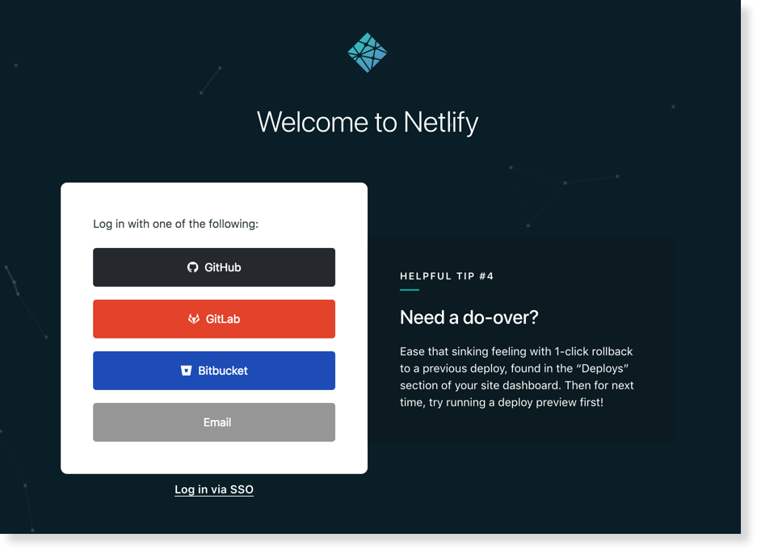
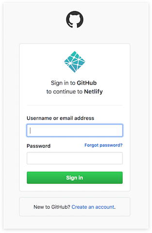
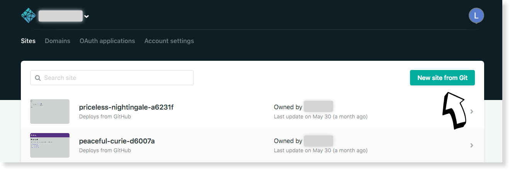
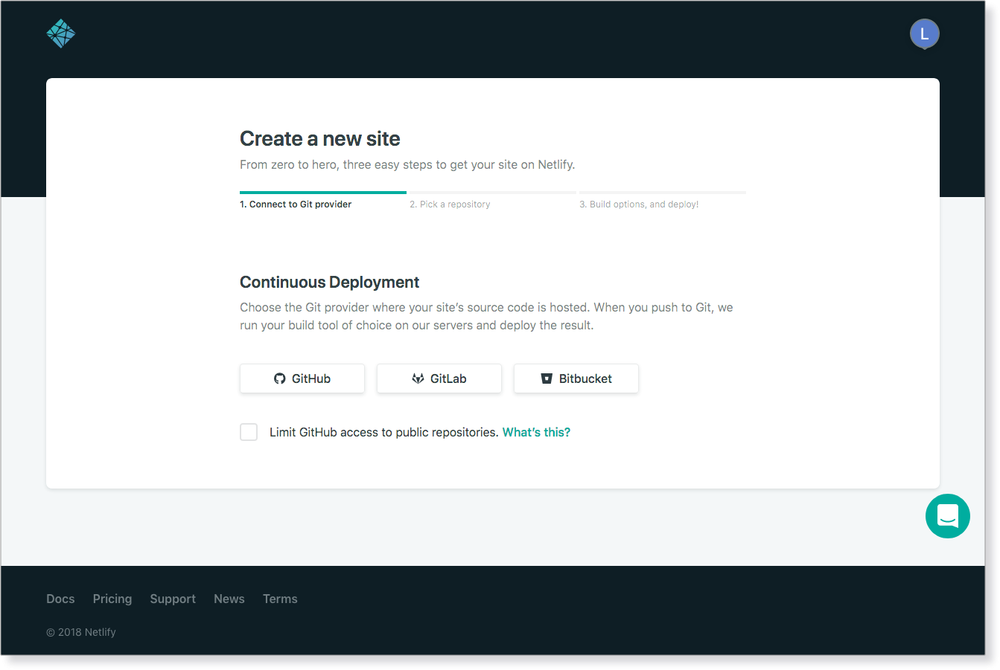
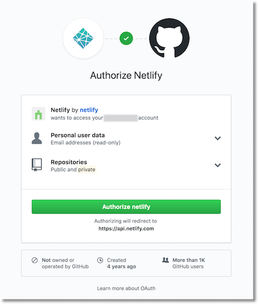
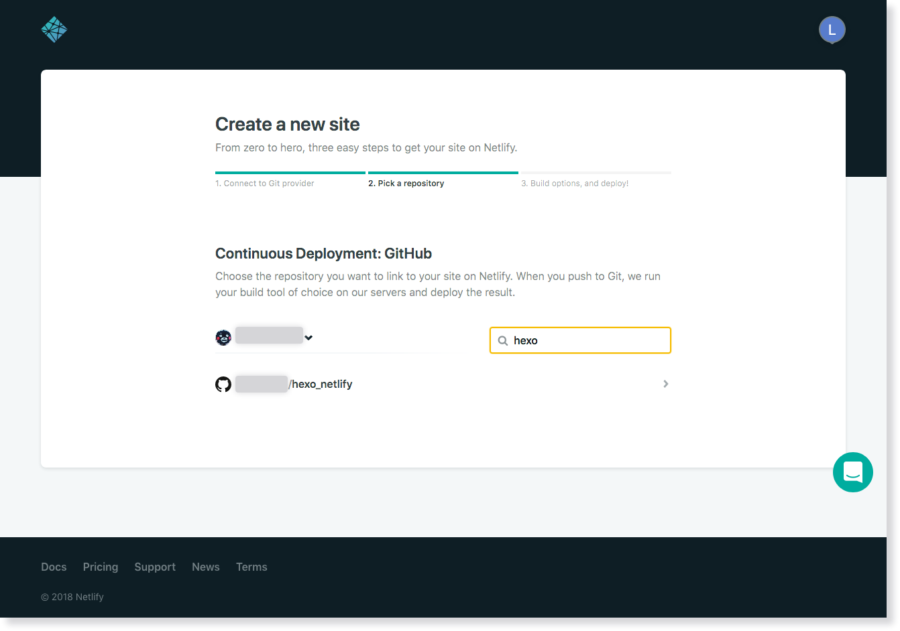
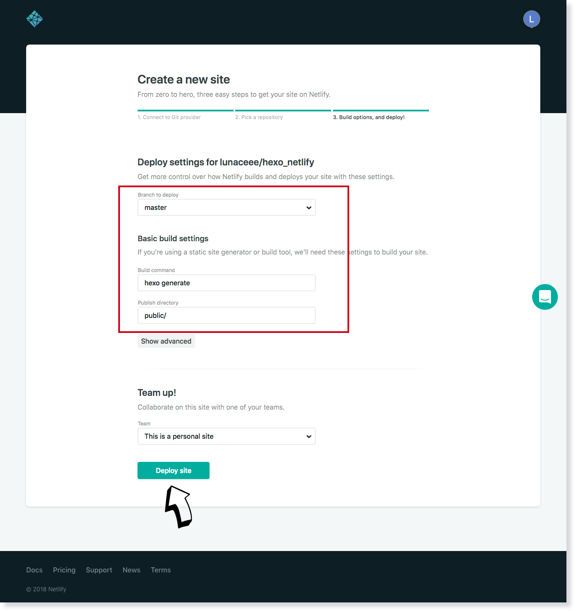
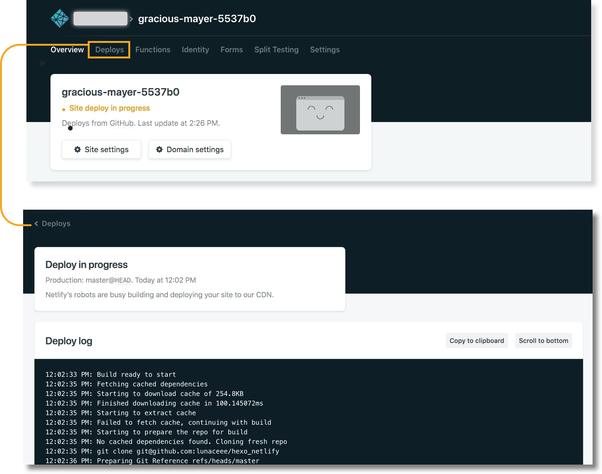
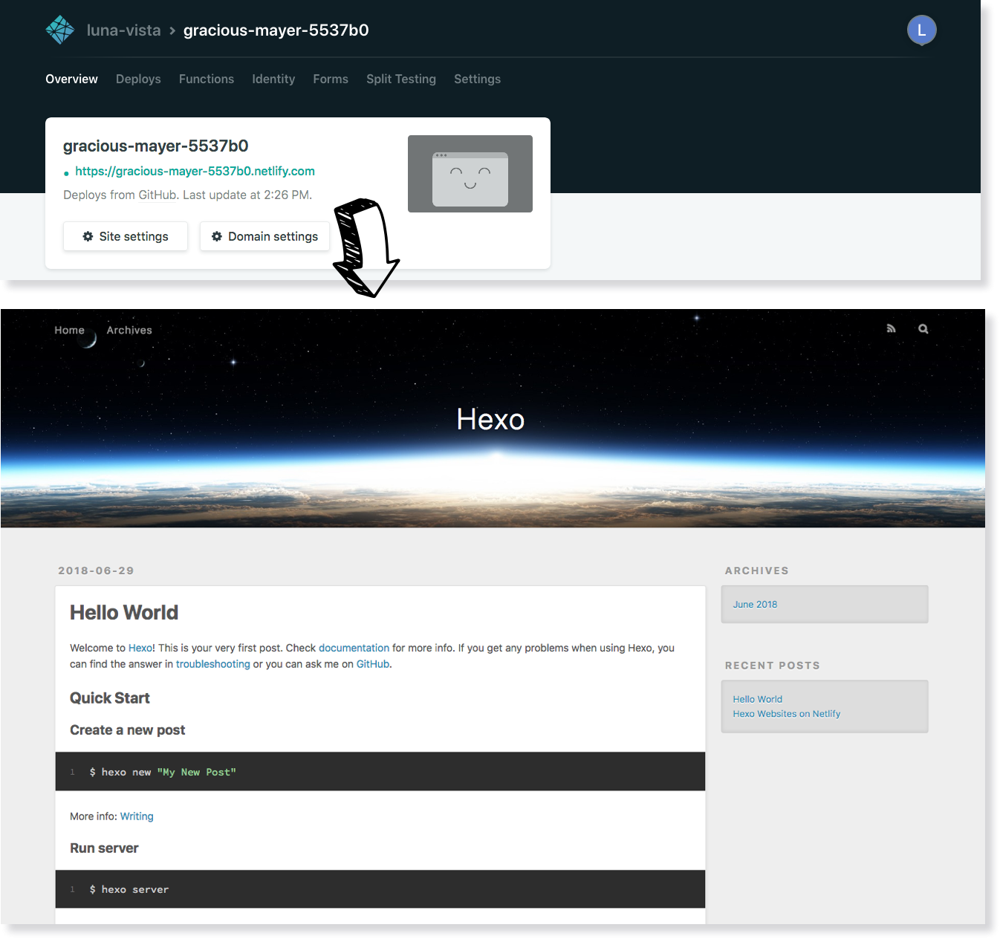
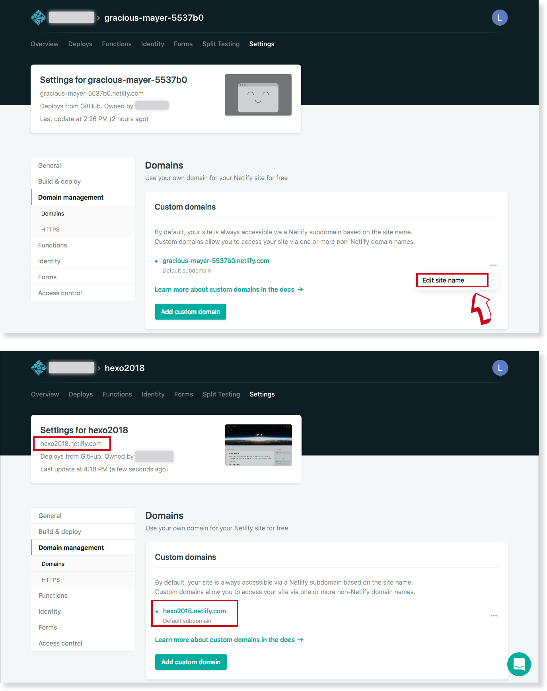

title: Deployment
---
Hexo provides a fast and easy deployment strategy. You only need one single command to deploy your site to your servers.

``` bash
$ hexo deploy
```

Before your first deployment, you will have to modify some settings in `_config.yml`. A valid deployment setting must have a `type` field. For example:

``` yaml
deploy:
  type: git
```

You can use multiple deployers. Hexo will execute each deployer in order.

``` yaml
deploy:
- type: git
  repo:
- type: heroku
  repo:
```

## Git

Install [hexo-deployer-git].

``` bash
$ npm install hexo-deployer-git --save
```

Edit settings.

``` yaml
deploy:
  type: git
  repo: <repository url>
  branch: [branch]
  message: [message]
```

Option | Description
--- | ---
`repo` | GitHub/Bitbucket/Coding/GitLab repository URL
`branch` | Branch name. The deployer will detect the branch automatically if you are using GitHub or GitCafe.
`message` | Customize commit message (Default to `Site updated: {{ now('YYYY-MM-DD HH:mm:ss') }}`)


## Heroku

Install [hexo-deployer-heroku].

``` bash
$ npm install hexo-deployer-heroku --save
```

Edit settings.

``` yaml
deploy:
  type: heroku
  repo: <repository url>
  message: [message]
```

Option | Description
--- | ---
`repo`, `repository` | Heroku repository URL
`message` | Customize commit message (Default to `Site updated: {{ now('YYYY-MM-DD HH:mm:ss') }}`)

## Netlify

[Netlify](https://www.netlify.com/) provides continuous deployment services, global CDN, ultra-fast DNS, atomic deploys, instant cache invalidation, automatic HTTPS, a browser-based interface, a CLI, and many other features for managing your Hexo website. 

Go to https://app.netlify.com/signup and select your preferred signup method. This will likely be a hosted Git provider, although you also have the option to sign up with an email address.

There are two different ways to deploy your sites on Netlify.

1. Use the web UI
   
   The following examples use GitHub, but other git providers will follow a similar process.
  ### Create a Netlify account
  
  
  
  Selecting GitHub will bring up an authorization modal for authentication.
  
  

  ### Create a new site with continuous deployment
  You’re now already a Netlify member and should be brought to your new dashboard. Select “New site from git.”
  
  
  Netlify will then start walking you through the steps necessary for continuous deployment. First, you’ll need to select your git provider again, but this time you are giving Netlify added permissions to your repositories.
  
  

  And then again with the GitHub authorization window:


  

  Select the repo you want to use for continuous deployment. If you have a large number of repositories, you can filter through them in real time using repo search:
  
  

  Once selected, you’ll be brought to a screen for basic setup. Here you can select the branch you wanted published, your build command, and your publish (i.e. deploy) directory. 
  
  

  The publish directory should mirror that of what you’ve set in your site configuration, the default of which is `public`. 

  ### Build and Deploy Site
  Once you click on the `Deploy site` button, Netlify will start building and deploying your site.
  You'll be taken to the site dashboard. You should see some yellow text on the "Hero Card" indicating that your site is being deployed in progress.
  
  

  Once the build is finished—this should only take a few seconds–you should now see an auto generated URL of your site in green. 

  

  You can update the URL in “Domain Settings.”

  

  Now every time you push changes to your hosted git repository, Netlify will rebuild and redeploy your site automatically.

2. Alternatively, you can use [netlifyctl](https://github.com/netlify/netlifyctl) to manage and deploy sites on Netlify without leaving your terminal.

You can also add a [Deploy to Netlify Button](https://www.netlify.com/docs/deploy-button/) in your README.file to allow others to create a copy of your repository and be deployed to Netlify via one click.


## Rsync

Install [hexo-deployer-rsync].

``` bash
$ npm install hexo-deployer-rsync --save
```

Edit settings.

``` yaml
deploy:
  type: rsync
  host: <host>
  user: <user>
  root: <root>
  port: [port]
  delete: [true|false]
  verbose: [true|false]
  ignore_errors: [true|false]
```

Option | Description | Default
--- | --- | ---
`host` | Address of remote host |
`user` | Username |
`root` | Root directory of remote host |
`port` | Port | 22
`delete` | Delete old files on remote host | true
`verbose` | Display verbose messages | true
`ignore_errors` | Ignore errors | false

## OpenShift

Install [hexo-deployer-openshift].

``` bash
$ npm install hexo-deployer-openshift --save
```

Edit settings.

``` yaml
deploy:
  type: openshift
  repo: <repository url>
  message: [message]
```

Option | Description
--- | ---
`repo` | OpenShift repository URL
`message` | Customize commit message (Default to `Site updated: {{ now('YYYY-MM-DD HH:mm:ss') }}`)

## FTPSync

Install [hexo-deployer-ftpsync].

``` bash
$ npm install hexo-deployer-ftpsync --save
```

Edit settings.

``` yaml
deploy:
  type: ftpsync
  host: <host>
  user: <user>
  pass: <password>
  remote: [remote]
  port: [port]
  ignore: [ignore]
  connections: [connections]
  verbose: [true|false]
```

Option | Description | Default
--- | --- | ---
`host` | Address of remote host |
`user` | Username |
`pass` | Password |
`remote` | Root directory of remote host | `/`
`port` | Port | 21
`ignore` | Ignore the files on either host or remote |
`connections` | Connections number | 1
`verbose` | Display verbose messages | false

## SFTP

Install [hexo-deployer-sftp]. Deploys the site via SFTP, allowing for passwordless connections using ssh-agent.

``` bash
$ npm install hexo-deployer-sftp --save
```

Edit settings.

``` yaml
deploy:
  type: sftp
  host: <host>
  user: <user>
  pass: <password>
  remotePath: [remote path]
  port: [port]
  privateKey: [path/to/privateKey]
  passphrase: [passphrase]
  agent: [path/to/agent/socket]
```

Option | Description | Default
--- | --- | ---
`host` | Address of remote host |
`user` | Username |
`pass` | Password |
`remotePath` | Root directory of remote host | `/`
`port` | Port | 22
`privateKey` | Path to a ssh private key |
`passphrase` | Optional passphrase for the private key | 
`agent` | Path to the ssh-agent socket | `$SSH_AUTH_SOCK`

## Other Methods

All generated files are saved in the `public` folder. You can copy them to wherever you like.

[hexo-deployer-git]: https://github.com/hexojs/hexo-deployer-git
[hexo-deployer-heroku]: https://github.com/hexojs/hexo-deployer-heroku
[hexo-deployer-rsync]: https://github.com/hexojs/hexo-deployer-rsync
[hexo-deployer-openshift]: https://github.com/hexojs/hexo-deployer-openshift
[hexo-deployer-ftpsync]: https://github.com/hexojs/hexo-deployer-ftpsync
